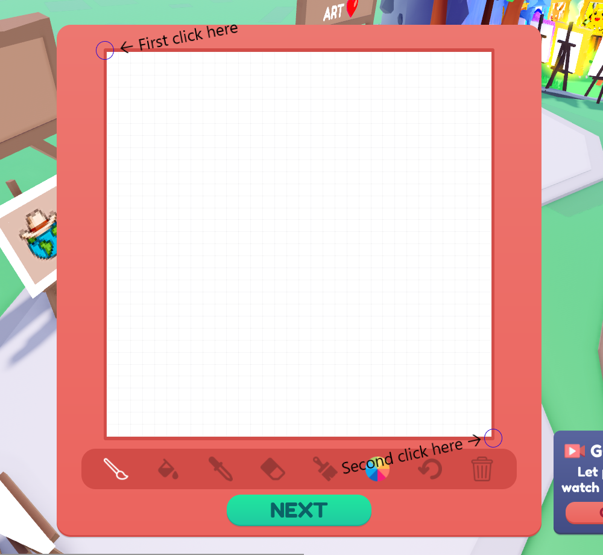
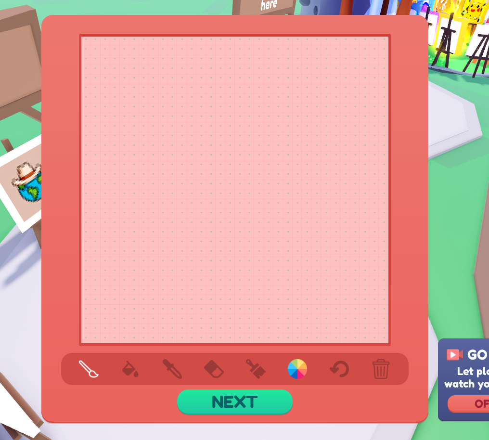

# Using Pixeler.Net

After opening Pixeler.Net, a window will appear.

If this is your first time using Pixeler.Net, click the button with
the text `Edit Configuration`. This will open another window with tools
to help configure where Pixler.Net will paint your picture.

## Setting Up Canvas Bounds

To setup the bounds of your canvas (which will let Pixeler.Net know *where* your
in-game canvas is on your screen), click the button with the text `Set` (it's to the
right of the `Canvas Coordinates` label). The text of the `Set` button with change
to `Cancel` and Pixeler.Net will listen for you to click twice. Once for the upper left
corner of your canvas, the second being the bottom right corner.



Once you have clicked both points, the text of the button should revert back to `Set`, meaning the coordinates have been captured.

To verify that the coordinates are correct, click the `Visualize Bounds` button to the right of the `Confirm Configuration` button. This will bring up a red semi-transparent box filled with black dots which visualize where each click will happen.



After clicking this and seeing the red box appear, you'll notice that the controls
directly above the `Visualize Bounds` button are no longer grayed out. These are
controls for editing where both coordinate points are located, allowing you to shrink, expand, or move the coordinate plane. There is also a numerical selector which will let you customize the step count (how many pixels to move the selected point(s)). It defaults to 5, can go as low as 1, and as high as 100.

Once you're done, click `Confirm Configuration`. This will save your config to memory and so file (A .json file in your `%APPDATA%` directory). Clicking the `X` to close
the window will ***discard any changes***.

## Selecting Your Image

To select your image, press the `Browse` button in the main Pixeler.Net window.
This will open Explorer allowing you to select your image.

Supported image types:
 - QOI
 - Webp
 - BMP
 - TGA
 - GIF
 - PBM
 - TIFF
 - PNG
 - JPEG (JPG)

## Starting The Paint

After you've made your configurations and set the canvas points, click `Start Painting`
and let go if your mouse. Pixeler.Net will start painting your image.

If something goes wrong, or the canvas was not configured right, spam `G` to cancel the paint job. Or, if you're fast enough, close out of Pixeler.Net. All configurations are saved after hitting `Confirm Configurations` on the configuration window, so you don't have to start from the beginning.


## Advanced Topics

### Speed Multiplier

The speed multiplier can be configured by the numerical selector in the configuration
window. The default value is 1, minimum value is 0, maximum is 100, and helps determine the wait time between each action.
A lower speed multiplier means a faster paint job at the risk of accuracy (some pixels might be missed, or the hex color selector will be clicked through, missing a color swap), or a slower paint job for better accuracy. The choice is up to you.

The math behind the speed multiplier is

```
delay = (speed_multiplier * 10ms)
```

So if the given multiplier were `1`, then the delay per action would be `10ms`.
If the multiplier were `0.5`, then the delay would be `5ms`, `2` would give `20ms`, and so on.

### Painting Method

While in the configuration menu, you probably saw a dropdown menu with the label `Paint Method`. This allows you to change the way the painting is drawn.
The default value is `Classic` which just goes from left to right, top to bottom painting all pixels. But there are some other options.

| Painting Method  | Description |
| ------------- | ------------- |
| `Classic` | Paints your picture from left to right, top to bottom. Usually takes ~250 seconds. |
| `ColorByColor` | Paints your image in groups of colors, going from dark colors to light. This can help minimize paint time by not switching colors from the hex color selector as often. |
| `MostToLeastAppearance` | Paints your image in order from colors that appear the most, to colors that appear the least. This minimizes the paint time by not switching colors from the hex color selector as often. |